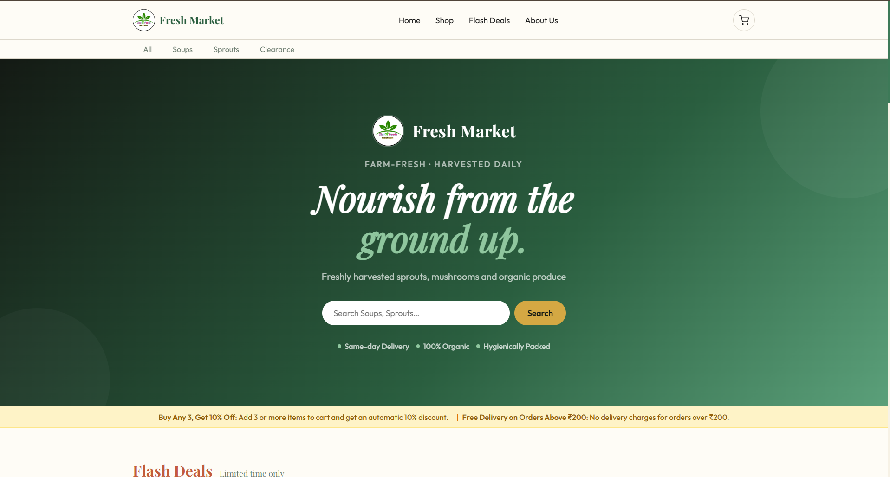
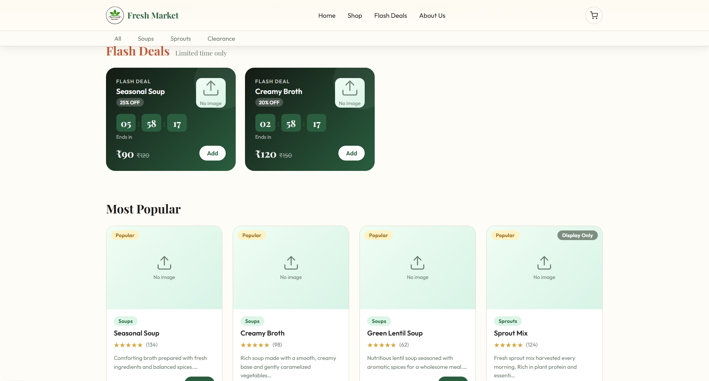
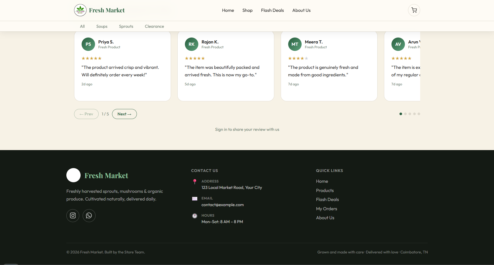
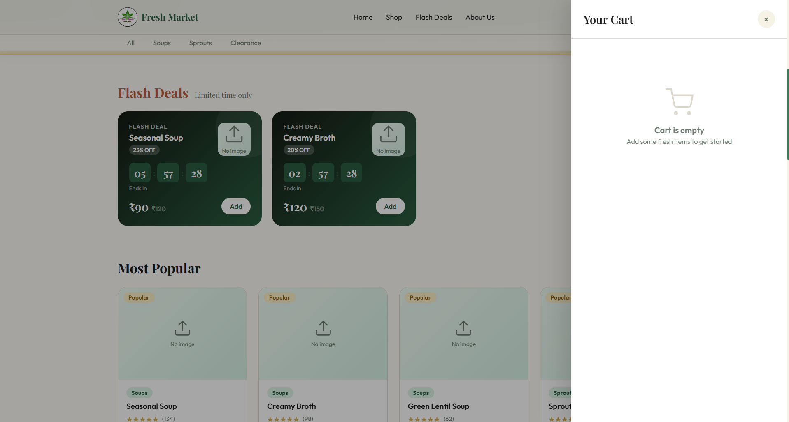

# Fresh Market Storefront Demo

A polished, full-stack storefront demo built with React, Vite, Express and SQLite.

[](https://github.com/Pravinkumar-04/-Fresh-Market-Storefront-Demo) [](https://opensource.org/licenses/MIT) [](https://github.com/Pravinkumar-04/-Fresh-Market-Storefront-Demo)

---

## 🚀 Overview

A modern storefront demo with a responsive customer shopping experience, guest checkout, review system, and a secure admin management backend.

- Built with **React + Vite** for a fast frontend
- Backend powered by **Express + SQLite**
- Deploy-ready for **GitHub Pages** with relative paths
- Designed for **easy customization** and clean visuals

## ✨ Features

### Customer Experience

- Product browsing with catalog filtering
- Flash deals, offers, and popular products
- Guest checkout and order reporting
- Review submission for customer feedback

### Admin & Backend

- JWT-based user and admin authentication
- Secure password hashing with bcrypt
- Admin dashboard for products, orders, and deals
- Lightweight SQLite persistence for fast local setup

## 📦 Quick Start

```bash
npm install
npm run server
npm run dev
```

Open the app at `http://localhost:5173`.

## 🖼️ Screenshots

### Homepage & Hero Section


### Flash Deals & Popular Products


### Customer Reviews


### Shopping Cart


---

## 📌 Notes

- This repository is sanitized and generic for publishing.
- Use the GitHub Pages branch `gh-pages` for live site deployment.
